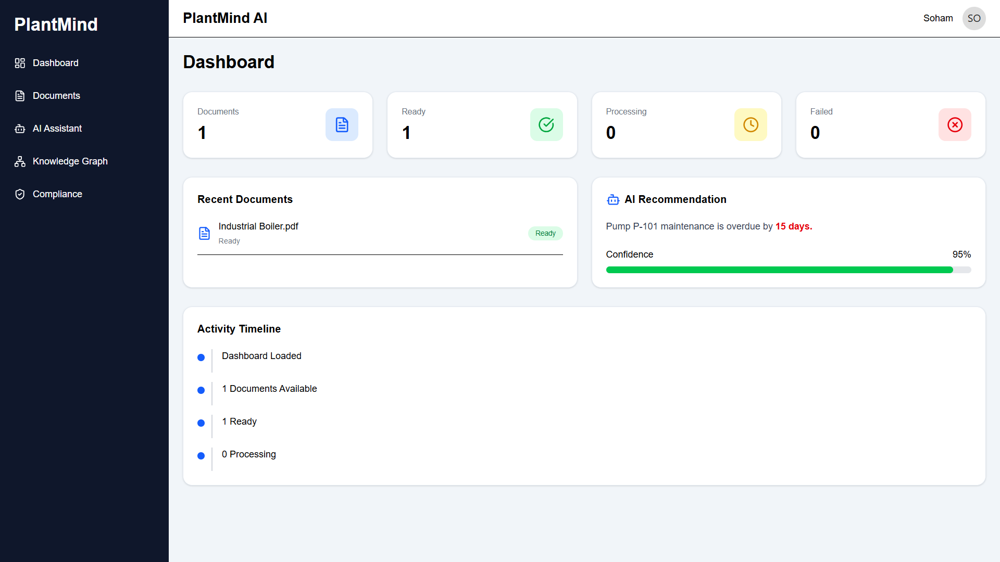
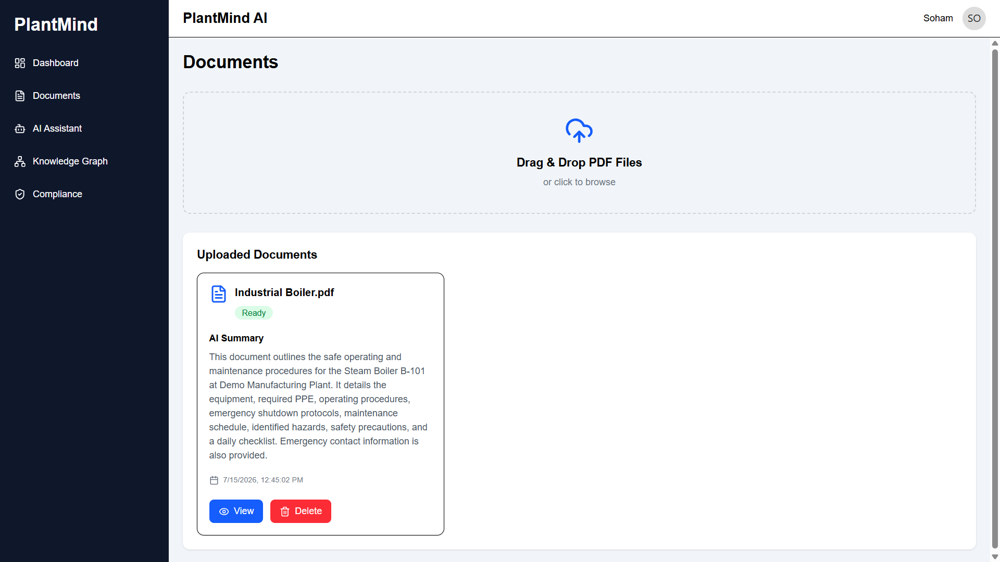
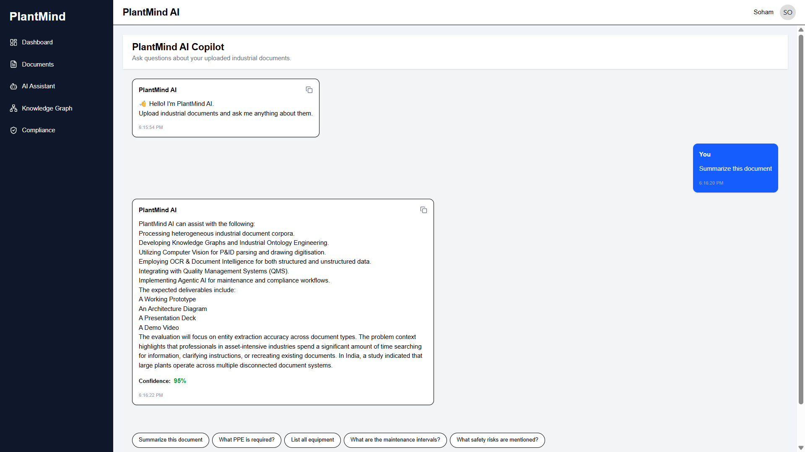
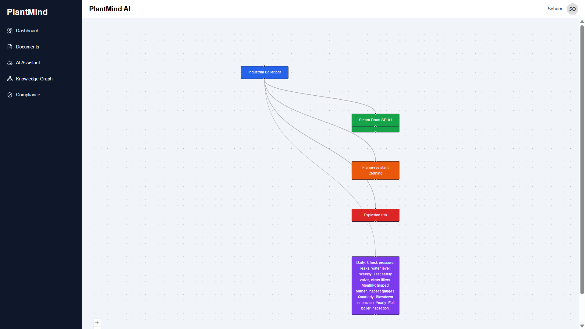
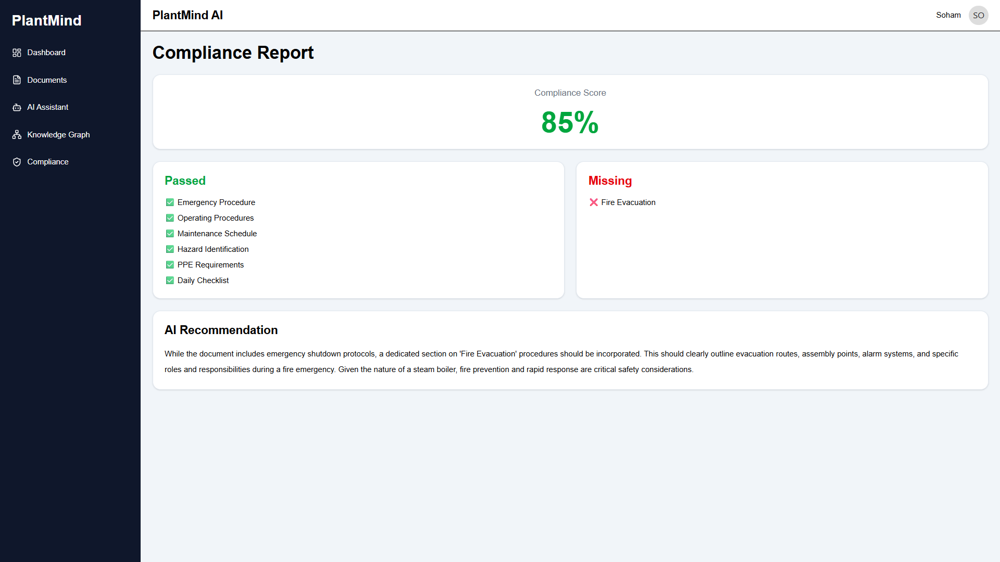

# PlantMind AI

### AI-Powered Industrial Knowledge Intelligence Platform

PlantMind AI is an AI-powered Industrial Knowledge Intelligence Platform that helps industries transform technical documents into actionable knowledge. It leverages **Google Gemini AI**, **Retrieval-Augmented Generation (RAG)**, **Knowledge Graphs**, and **Semantic Search** to make industrial manuals, SOPs, maintenance records, and safety documents searchable, understandable, and interactive.

---

## 🚀 Problem Statement

**Problem Statement #8 - AI for Industrial Knowledge Intelligence: Unified Asset & Operations Brain**

Build an AI-powered Industrial Knowledge Intelligence platform that ingests heterogeneous documents—including engineering drawings, maintenance records, safety procedures, inspection reports, operating instructions, and project files—and transforms them into searchable, actionable, and continuously updated knowledge.

---

# ✨ Key Features

### 📄 Smart Document Upload
- Upload industrial PDFs
- Automatic document storage
- Metadata extraction

### 🤖 AI Document Analysis
- AI-generated summaries
- Equipment extraction
- PPE extraction
- Risk identification
- Maintenance schedule extraction

### 💬 AI Chat Assistant (RAG)
- Ask questions about uploaded documents
- Context-aware responses
- Semantic document retrieval

### 🌐 Interactive Knowledge Graph
- Visual representation of extracted entities
- Equipment relationships
- Risk visualization
- Interactive exploration

### 🛡️ Compliance Checker
- AI-powered compliance analysis
- Compliance score generation
- Missing safety requirements detection
- AI recommendations

### 📊 Dashboard
- Live document statistics
- Processing status
- Recent uploads
- Activity timeline

---

# System Architecture

```
                    +----------------------+
                    |    Upload PDF        |
                    +----------+-----------+
                               |
                               v
                    +----------------------+
                    |    FastAPI Backend   |
                    +----------+-----------+
                               |
             +-----------------+-----------------+
             |                                   |
             v                                   v
      SQLite Database                  Gemini AI Analysis
             |                                   |
             +-----------------+-----------------+
                               |
                               v
                  Extracted Knowledge
                               |
          +----------+----------+----------+
          |          |          |          |
          v          v          v          v
      Summary    Equipment     Risks      PPE
                               |
                               v
                    FAISS Vector Database
                               |
                               v
                      RAG Chat Assistant
                               |
                               v
                    Interactive Knowledge Graph
```

---

# 🛠️ Technology Stack

## Frontend
- React.js
- Vite
- Tailwind CSS
- React Router
- React Flow
- Axios
- Lucide React

## Backend
- FastAPI
- SQLAlchemy
- SQLite
- Uvicorn

## Artificial Intelligence
- Google Gemini API
- Sentence Transformers
- FAISS Vector Search

---

# 📂 Project Structure

```
PlantMind-AI/
│
├── backend/
│   ├── app/
│   │   ├── routers/
│   │   ├── services/
│   │   ├── uploads/
│   │   ├── vectorstore/
│   │   ├── database.py
│   │   ├── models.py
│   │   └── main.py
│   ├── requirements.txt
│   └── .env
│
├── frontend/
│   ├── src/
│   ├── package.json
│   └── vite.config.js
│
├── screenshots/
└── README.md
```

---

# ⚙️ Installation

## Clone Repository

```bash
git clone https://github.com/SohamDey2005/PlantMind-AI.git

cd PlantMind-AI
```

---

## Backend Setup

```bash
cd backend

python -m venv venv
```

### Windows

```bash
venv\Scripts\activate
```

### Install Dependencies

```bash
pip install -r requirements.txt
```

Create a `.env` file

```env
GEMINI_API_KEY=YOUR_GEMINI_API_KEY
```

Run Backend

```bash
uvicorn app.main:app --reload
```

Backend runs at

```
http://localhost:8000
```

---

## Frontend Setup

```bash
cd frontend

npm install

npm run dev
```

Frontend runs at

```
http://localhost:5173
```

---

# 🖥️ Application Workflow

1. Upload an industrial PDF.
2. AI analyzes the document.
3. Metadata is extracted.
4. Embeddings are created.
5. FAISS indexes the document.
6. Users ask questions through the chatbot.
7. Relevant context is retrieved.
8. Gemini generates an accurate response.
9. Knowledge Graph visualizes relationships.
10. Compliance Checker evaluates safety requirements.

---

# 📸 Screenshots

## Dashboard



---

## Document Upload



---

## AI Chat



---

## Knowledge Graph



---

## Compliance Checker



---

# 🌟 Future Enhancements

- OCR support for scanned PDFs
- Multi-language document analysis
- Predictive maintenance insights
- Plant Health Score
- IoT sensor integration
- Role-based access control
- Cloud deployment
- Multi-document reasoning

---

# 👨‍💻 Team

**Project Name:** PlantMind AI

**Created By:** Soham Dey

Developed as part of **ET AI Hackathon 2.0 Problem Statement #8**.

---